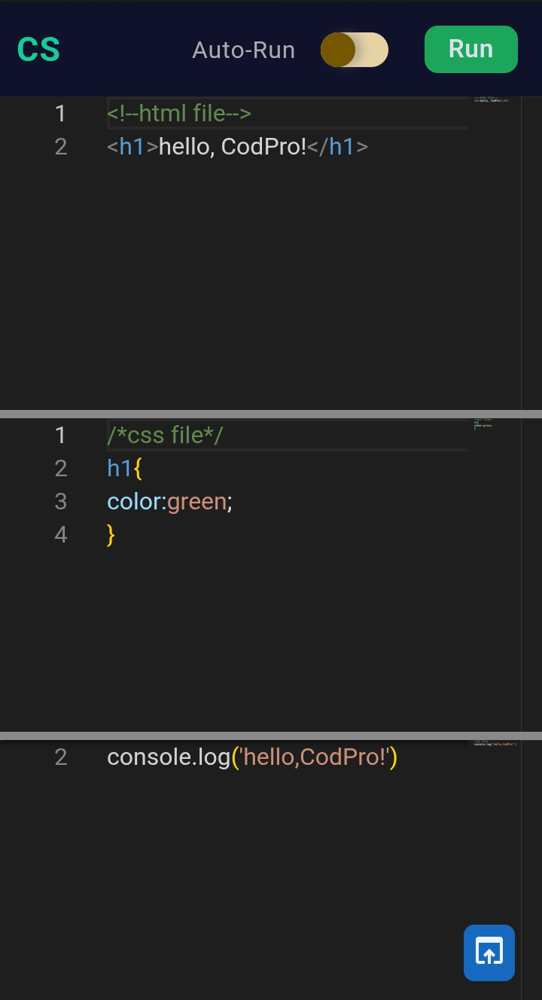
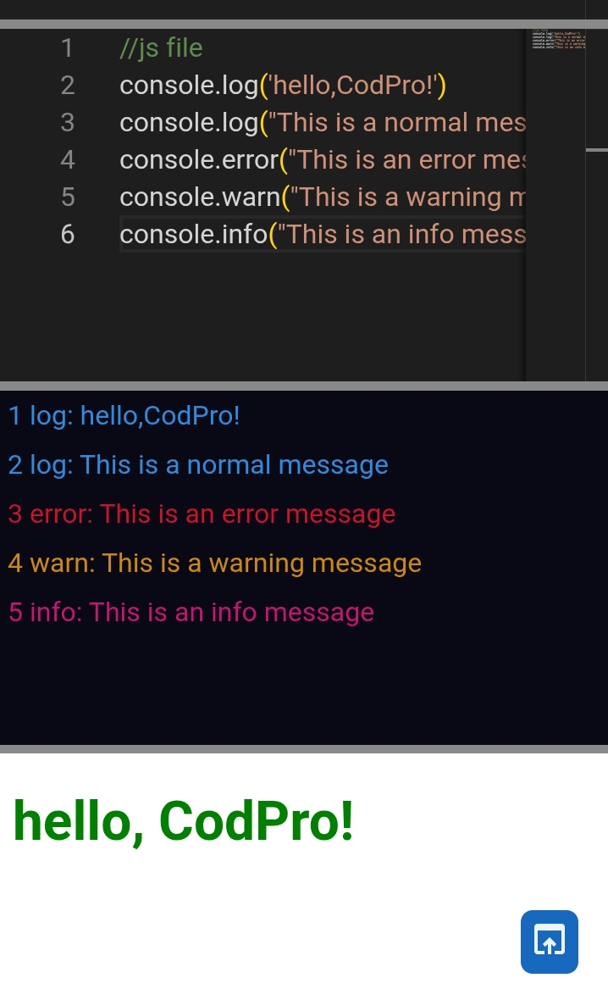
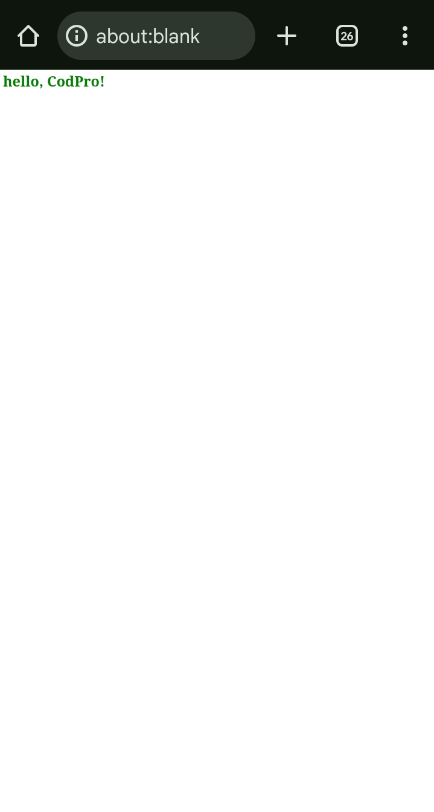

# Welcome to CodPro-Playground-Editor


## Description 
-Simple and easy html,css and js editor, lightweight with UI editor.

### Features
```markdown
-uses: Use it for test purpose and simple task.
-site: https://codpro-sui.github.io/CodPro-Playground-Editor/
```

## Initial step
```javascript
require.config({ paths: { "vs": "https://cdn.jsdelivr.net/npm/monaco-editor@0.44.0/min/vs" } });
var htmlEditor, cssEditor, jsEditor;
require(["vs/editor/editor.main"], function() {
  htmlEditor = monaco.editor.create(document.querySelector(".html-editor"), {
    value: "<!--html file-->\n<h1>hello, CodPro!</h1>",
    language: "html",
    fontSize: 16,
    theme: "vs-dark",
    automaticLayout: true
  });
  cssEditor = monaco.editor.create(document.querySelector(".css-editor"), {
    value: "/*css file*/\nh1{\ncolor:green;\n}",
    language: "css",
    fontSize: 16,
    theme: "vs-dark",
    automaticLayout: true
  });
  jsEditor = monaco.editor.create(document.querySelector(".js-editor"), {
    value: "//js file\nconsole.log('hello,CodPro!')",
    fontSize: 16,
    language: "javascript",
    theme: "vs-dark",
    automaticLayout: true
  });
})
```


## Open in new tab in chrome 
```javascript
let openInChrome = () =>{
  run.click();
  let targetOpen = window.open("","_blank");
  targetOpen.document.open();
  targetOpen.document.write(chromeText);
  targetOpen.document.close();
}
document.querySelector(".open").addEventListener("click",openInChrome);

```
## Message event listener from iframe
```javascript
var chromeText;
const execute = () => {
  consoleBox.innerHTML = "";
  let htm = htmlEditor.getValue();
  let css = `<style>${cssEditor.getValue()}</style>`;
  let js = jsEditor.getValue();
  const consoleProgram = `<script>
        const send = (type,...args) =>
          parent.postMessage({type,data:args.join(" ")},"*");
          console.log = (...a) => send("log",...a);
          console.error = (...a) => send("error",...a);
          console.warn = (...a) => send("warn",...a);
          console.info = (...a) => send("info",...a);
        try{
          ${js}
        }catch(error){
          console.error(error)
        }
      <\/script>`;
      chromeText = htm + css + consoleProgram;
  output.srcdoc = htm + css + consoleProgram;
}

run.addEventListener("click", execute);
```

## Third-party source editor highlight use
```javascript
  <script src="https://cdn.jsdelivr.net/npm/monaco-editor@0.44.0/min/vs/loader.js"></script>
```

### Screenshot of editor with responsive


### console result features with modern stylish 


### Open result in new tab in google Chrome 


